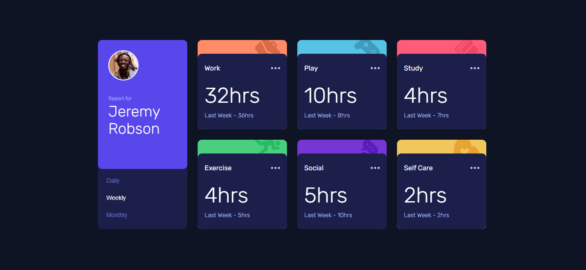

# Frontend Mentor - Time Tracking Dashboard

## Table of Contents

* [Overview](#overview)

  * [The Challenge](#the-challenge)
  * [Screenshot](#screenshot)
  * [Links](#links)
* [My Process](#my-process)

  * [Built With](#built-with)
  * [What I Learned](#what-i-learned)
  * [Continued Development](#continued-development)
* [Author](#author)
* [Acknowledgments](#acknowledgments)

---

## Overview

### The Challenge

Users should be able to:

* View the optimal layout based on their device’s screen size
* See hover states for all interactive elements
* Switch between **Daily, Weekly, and Monthly** time tracking stats
* See updated previous timeframe data dynamically

👉 This project focuses on building a responsive dashboard and handling dynamic data using JavaScript.

---

### Screenshot

---

### Links

* **Solution URL:** https://github.com/IrfanAnsari21/time-tracking-dashboard.git
* **Live Site URL:** https://frontendmentor-timetracking-dashboard.netlify.app/

---

## My Process

### Built With

* Semantic HTML5
* CSS3
* Flexbox & Grid
* Mobile-first workflow
* JavaScript (data fetching & DOM manipulation)

---

### What I Learned

This project helped me understand how to work with **JSON data** and dynamically update UI based on user interaction.

I learned:

* How to fetch and use data from a `data.json` file
* How to switch between different timeframes (daily, weekly, monthly)
* How to update UI elements dynamically using JavaScript

---

### Continued Development

In future projects, I want to:

* Improve code structure and reusability
* Add animations for smoother transitions
* Focus more on accessibility
* Build similar dashboards using React

---

## Author

* GitHub – https://github.com/IrfanAnsari21
* Frontend Mentor – https://www.frontendmentor.io/profile/IrfanAnsari21

---

## Acknowledgments

Thanks to Frontend Mentor for providing this challenge. It helped me practice working with dynamic data and building responsive dashboard layouts.

